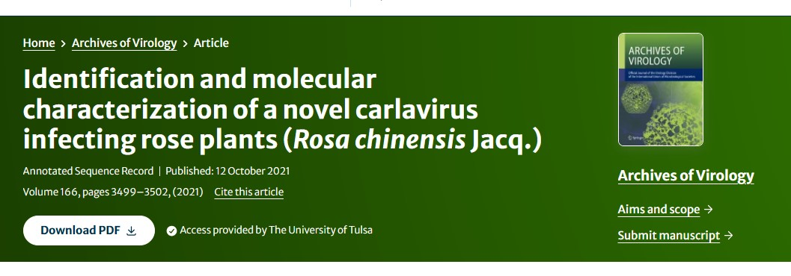

```{r setup, include=FALSE}
knitr::opts_chunk$set(echo = FALSE)
```

## **Introduction**

There are many research projects conducted on vastly different organisms that are not related to virus research. Because the focus on a given research task does not involve the detection or discovery of viruses, this is often overlooked and provides an opportunity for virologists to comb through the data and see if viruses are present. Given that each organism present on plant Earth is estimated to be infected by at least one virus, this provides ample opportunity to discover novel viruses in a host of interest.

Not only is this conceptual, but this as been applied in a variety of hosts. I will focus on viruses isolated from roses in this case.

## **Examples from the literature**

- In roses:

```{r fig1, fig.cap="", echo=FALSE, fig.width=2, fig.height=2, fig.align='center'}

```

- **RVC** was found by looking through transcriptome data
- This can help in the future as growers and diagnosticians decide which viruses they should screen for.

Reference: Xing, F., Gao, D., Habili, N., Wang, H., Zhang, Z., Cao, M., & Li, S. (<mark>2021</mark>). Identification and molecular characterization of a novel carlavirus infecting rose plants (Rosa chinensis Jacq.). Archives of Virology, 166, 3499-3502.

## **Research Questions**

1. Are there viruses that are capable of infecting roses that have not yet been reported, but have been sequenced "serendipitously" by HTS methods?

2. Are there novel viruses that have not yet been characterized but were sequenced as a "byproduct" of some other experimental focus?

## **Predictions/expected outcomes**

I am hopeful to develop a useful tool for analyzing our own HTS data. In addition, I am hopeful to use this tool to "screen" available HTS data for the presence of plant viruses in roses. In practice, this could be used for any plant host to determine if there are novel or unreported viruses from a given region of the world. Ideally, it would be useful to create a pipeline where we can simply input the raw fastq files and output the results from the BLAST search.

## **Overview of the project**

1. Obtain SRA data (RNA-seq)
2. Download reference genome/s
3. QC and trimming of raw SRA data
4. Reference mapping of reads to host genome
5. Gather unmapped reads using the flags
6. Assembly of reads (rnaSPADES)
7. Create a database of viruses for nucleotide blast
8. Use Diamond for nucleotide-to-protein blasting
9. Evaluate results of unmapped reads

## 1. Obtain SRA data (RNA-seq)

- `Fastq dump` was used to obtain data associated with specific accessions

- Steps: **1)** NCBI **2)** SRA **3)** search species **4)** download accession list

[NCBI link for *Rosa chinensis*](https://www.ncbi.nlm.nih.gov/sra/?term=Rosa+chinensis)

Below are the files submitted to OSCER:

1) [sh file](scripts/fastq_dump.sh)

2) [sbatch script](scripts/fastq_dump.sbatch)

3) [.args](scripts/fastq_dump.args)


## 2. Download reference genome/s

- In this case, we will use the *Rosa chinensis* genome as a reference. This reference corresponds with the RNA-seq data downloaded in the previous section.

- Steps: **1)** Go to NCBI **2)** Go the genomes **3)** Search organism of interest **4)** Select FTP **5)** Copy link for file of interest (in our case, we will copy the link for both `genomic.fna.gz` and `genomic.gff.gz`)

[LINK to download reference genome](https://ftp.ncbi.nlm.nih.gov/genomes/all/GCA/002/994/745/)

1) [sh script](scripts/rose_reference.sh)

2) [sbatch file](scripts/rose_reference.sbatch)


## 3. `QC` and trimming of raw SRA data

- Here we are only looking at one sample, which is `SRR29872023_1` and `SRR29872023_2`. If we wanted to use an array system, we could look at all of the files and have `fastqc` run for each of them.

Below are the files submitted to OSCER:

1) [sbatch file](scripts/rose_fastqc.sbatch)

2) [sh script](scripts/rose_fastqc.sh)


## 3. `QC` and trimming of raw SRA data

<iframe src="data_output/SRR29872023_1_fastqc.html" width="100%" height="600px"></iframe>

## 3. `QC` and trimming of raw SRA data

<iframe src="data_output/SRR29872023_2_fastqc.html" width="100%" height="600px"></iframe>

## 3. QC and `trimming` of raw SRA data

Below are the files submitted to OSCER:

1) [sh script](scripts/rose_trimming.sh)

2) [sbatch file](scripts/rose_trimming.sbatch)


## 4. Reference mapping of reads to host genome

- Usually, we would use BWA (currently called `minimap2`) to map reads to a reference genome. We will be using `Hisat2` for read mapping because this program is optimized for mapping RNA reads onto a DNA genome.

- Steps: **1)** Create a reference index of the reference sequence **2)** Map raw, trimmed, or de novo assembled reads to the indexed reference sequence **3)** Generate a `.SAM` file (Simple Alignment format) **4)** Convert the `.SAM` to a `.BAM` (Binary alignment format) **5)** Sort the `.BAM` file.

1. creating a new environment
```bach
conda create -n hisat2_env
```

2. activate the environment
```bach
conda activate hisat2_env
```
Below I have included the script file for the `hisat2` mapping. 

1) [sh script](scripts/hisat_mapping.sh)

2) [sbatch file](scripts/hisat_mapping.sbatch)

## 4. Reference mapping of reads to host genome


1) [sh script](scripts/sam_bam_sort_in.sh)

2) [sbatch file](scripts/sam_bam_sort_in.sbatch)

## 4. Reference mapping of reads to host genome

```{r fig.cap="Looking at the mapping stats generated by smatools"}
# Specify the path to your text file
file_path <- "data_output/mappingstats.txt"

# Read the text file
text_content <- readLines(file_path)

# Print the content of the text file
cat(head(text_content, 30), sep = "\n")
```

## 4. Reference mapping of reads to host genome

```{r fig.cap="Looking at the mapping stats generated by qualimap"}
# Specify the path to your text file
file_path <- "data_output/genome_results.txt"

# Read the text file
text_content <- readLines(file_path)

# Print the content of the text file
cat(head(text_content, 30), sep = "\n")
```

## 4. Reference mapping of reads to host genome

```{r fig.cap="Looking at the mapping stats generated by hisat2"}
# Specify the path to your text file
file_path <- "data_output/alignment_summary.txt"

# Read the text file
text_content <- readLines(file_path)

# Print the content of the text file
cat(head(text_content, 30), sep = "\n")
```

## 5. Gather unmapped reads using the flags

- After mapping the reads to the host genome (remove unnecessary reads), we can use the samtools `flag` command to extract unmapped reads. In our case, we are interested in the unmapped reads, as these may contain virus reads and subsequent virus sequences.

- Steps: 1) Gather the unmapped reads with the soomtools `flagstats` command 2) convert the `.BAM` file to `fastq`.

- I was able to use both tools (bedtools and samtools) to generate fastq files from the `.BAM` file. Below are the documents submitted to OSCER:

1) [sh script](scripts/unmapped_reads.sh)

2) [sbatch file](scripts/unmapped_reads.sbatch)

## 6. Assembly of reads (rnaSPADES)

Below I have included my files for OSCER submission:

1) [sh script](scripts/assembly_quast.sh)

2) [sbatch file](scripts/assembly_quast.sbatch)

```{r fig.cap="", fig.width=2, fig.height=2, fig.align='center'}
# Specify the path to your text file
file_path <- "data_output/quast_report.txt"

# Read the text file
text_content <- readLines(file_path)

# Print the content of the text file
cat(head(text_content, 30), sep = "\n")
```

## 7. Create a database of viruses for nucleotide blast


## 8. Use Diamond for nucleotide-to-protein blasting


## 9. Evaluate results of unmapped reads


(Hisat2 which is best used for RNA onto DNA: think about exons)


